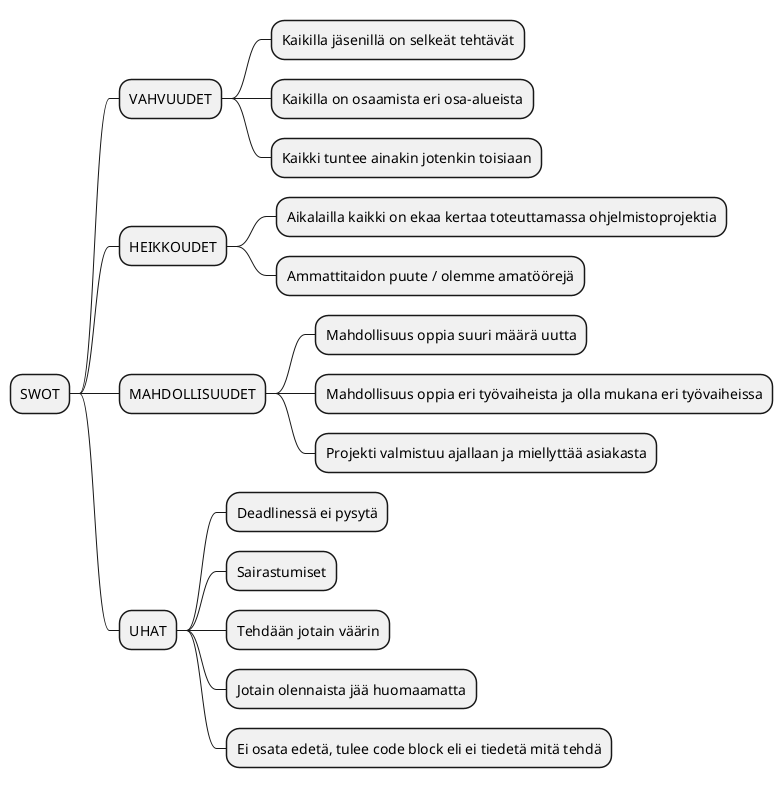
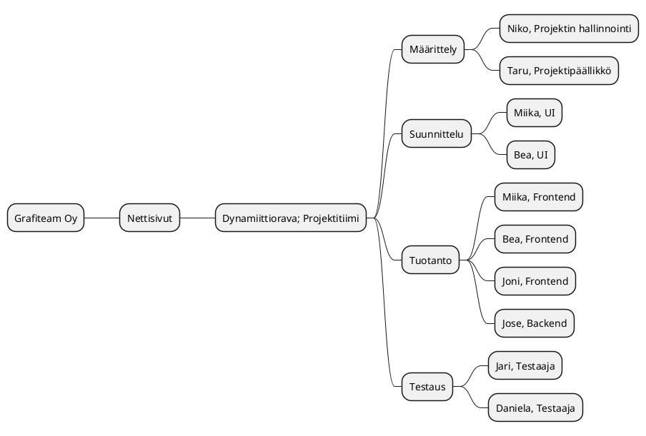
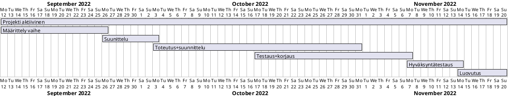
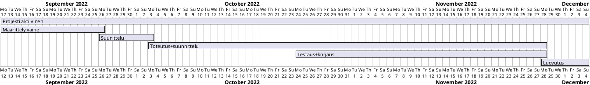

# Projektisuunnitelma

|  |  |
|:-:|:-:|
| Dokumentti | Projektisuunnitelma |
| Laatija: | Niko |
| Versio: | 5.5 |
| Päivämäärä: | 1.12.2022 |

## 1. Toimeksianto 

Grafiteam Oy:lle tuotamme uudet nettisivut Dynamiittiorava-tiimin toimesta. Nettisivujen toteutukseen annettiin tiimille avoimet kädet ja tällä tavalla sivut myös lähdemme toteuttamaan.

## 1.1 Tausta ja lähtökohdat

Dynamiittiorava-tiimi lähtee luomaan ja kehittämään asiakastyönä [**Grafiteam Oy**](https://www.grafiteam.fi/):lle uusia ja parempia nettisivuja. Projekti toteutetaan TE-palveluiden sekä JAMK:in järjestämän opintokokonaisuuden harjoittelujaksolla.
Projektin tarkoituksena on saada asiakkaan nettisivut toimimaan paremmin ja tehtyä ne asiakasta miellyttäväksi kokonaisuudeksi. Nettisivut toteutetaan asiakkaan haluamalla tavalla, mutta olemme saaneet vapaat kädet toteuttamiseen. Tässä tarkoitamme sitä, että kuuntelemme kaikkia asiakkaan toiveita ja vaatimuksia, mutta saamme silti tehdä sivun haluamallamme tavalla.

Asiakas on pieni yksityisyritys Luhangasta. Yritys on 2018 perustettu painopalveluita tarjoava pienyritys, jonka asiakkaat ovat niin pienet kuin suuret kotimaiset yritykset kuten [**Rapala**](https://www.rapala.fi/eu_fi/rapala), [**Arvid Nordquist**](https://www.arvidnordquist.fi), [**SIKA Finland**](https://fin.sika.com) ja [**Marttiini**](https://www.marttiini.fi/epages/MarttiiniShop.sf/fi_FI/?ObjectPath=/Shops/MarttiiniShop/Categories/Tuotteet&gclid=EAIaIQobChMI5rDNv66P-gIVakWRBR0lCAQPEAAYASAAEgJX4vD_BwE).
Paino- sekä tulostuspalveluista löytyy käyntikorttia, tarraa, banderollia, roll-uppeja, teippauksia sekä mainoskylttejä. Heiltä löytyy Keski-Suomen suurin UV-tulostin ja tämä mahdollistaa jopa 3,2 metriä leveää ja jopa 100 metriä pitkää printtiä melkein mille materiaaleille tahansa. Näiden ansiosta yrityksen nykyisillä sivuilla lukeekin **"Koolla on väliä"**.
Grafiteamin yksi tärkeistä osa-alueista ovat myös messuosastot, joihin heillä löytyy työkalut suunnittelusta tuotantoon. Palveluihin kuuluu myös mainoskylttien ja erilaisten teippausten asennukset. Valmistuksessa valmistuu myös erilaisia pakkauksia ja mm myyntitelineitä.

Kohderyhmänä yrityksellä on siis enemmänkin yritykset, kuin yksityiset asiakkaat ja tämä on otettava sivun toteutuksessa huomioon, mutta esimerkiksi uutena lisänä olevat veneiden teippaukset vetävät varmaankin enemmän asiakkaiksi yksityisiä asiakkaita, kuin yrityksiä.

Lähtökohtamme on siis se, että meillä on valmis sivu, josta saamme paljon visuaalisuuteen, kuten väreihin, fontteihin ja yleiseen ilmeeseen valmiit pohjat ja kaikkea ei tarvitse tehdä aloittaen täysin ruohonjuuritasolta. Silti aloitamme sivuston luomisen täysin nollasta ja emme ala muokkaamaan vanhaa sivustoa. Käytössä meillä on siis jo värit, logo ja muuta sisältöä, kuten linkit Instagramiin ja Facebookiin. Yritykseltä on tullut meille myös käyttöön läjäpäin kuvia sekä logot.

## 1.2 Tavoitteet ja tehtävät

Tavoitteena on saada yleinen ilme kotisivuilla paremmaksi toiminnaltaan, selkeäksi ja ammattimaiseksi. Sieltä täytyy löytyä kohderyhmille suunnattu sisältö visuaalisesti näyttävällä tavalla, oli kyseessä yritys tai yksityinen asiakas. Tällä hetkellä nettisivut kaipaavat paljonkin ehostusta ja muutoksia, koska sen toiminta sisältää mm. virheitä ja toimimattomuutta Instagram-päivitysten näkyvyydessä.
Keskiössä voisi oikeastaan pitää käytettävyyttä sekä kohdennettua tarjontaa, mutta ei liian pitkälle vietynä. Lähinnä tarkastellessa asiakkaan näkökulmasta toivoisi sivulle selkeyttä ja ammattimaisten painotuotteiden tuottavan yrityksen ammattimaista olemusta ja ilmettä. Sivulle mentäessä täytyisi tulla sellainen olo, että se tarjoaa sinulle sen, mitä sieltä lähdit etsimään. Yhdeydenotto lomakkeesta on luovuttu toimeksiantajan pyynnöstä ja yhteystiedot tulevat näkyviin selkeästi.

Tehtävälistana on aluksi ymmärtää asiakkaan yritystä ja sen yleisilmettä ja olemusta. Paremmin ilmaistuna tutustua vain yrityksen toimintaan, josta tuossa ylempänä jo aika kattava ja riittävä tietopankki onkin. Tämän kautta päästään määrittelyyn. Määrittelyssä määritetään koko projekti siihen pisteeseen mitä nyt pystyy edes määrittämään vielä tässä vaiheessa. Seuraavana hypätään suunnitteluun. Suunnittelussa otetaan huomioon yrityksen asiakaskunta ja kohderyhmät. Suunnittelussa on myös huomioitava sivuston toteutukseen liittyviä teknisiä toteutuksellisia menetelmiä. Näistä laaditaan mahdollisesti myös oma toteutuksellinen suunnitelma. Seuraavana vuorossa alkaa olemaan itse tuotannollinen vaihe. Suunnittelu elää vielä tässä vaiheessa, kun tuotetta ollaan asiakkaalle toteuttamassa. Sisältö tuotetaan täysin itse koodaamalla. Tuotannossa on kuitenkin paljon eri työvaiheita ja en niitä ala tässä erikseen käymään läpi. Lopussa testataan tuotteen toiminnallisuus ja korjataan mahdollisesti korjattavat asiat. Tämän jälkeen työn luovutus asiakkaalle ja sitten loppupalaveri.

## 1.3 Rajaus ja liittymät

Tähän on listattuna alle asioita, jotka rajattiin toteutuksesta pois, mutta jotka olisi mahdollista ollut projektissa toteuttaa. Alla listatut kohdat on riisuttu pois erinäisistä syistä, kuten kustannukseen ja asiakkaan toiveisiin liittyvistä syistä.

- Nettisivut toisella kielellä
- Yhteydenotto lomakkeesta
- Tietokanta

## 1.4 Oikeudet

Verkkosivujen luonnin ajaksi projektipäälliköllä on poweruser-käyttöoikeudet. Dynamiittioravan muulla henkilöstöllä on ylläpito-oikeudet.
katso [vaatimusmäärittely](https://ac8393.pages.labranet.jamk.fi/grafiteam-projekti/20-Vaatimustenhallinta/Vaatimusmaarittely/)

## 1.5 Projektiin liittyvät haasteet ja vahvuudet

### SWOT analyysi

## 2. Projektiorganisaatio

## 2.1 Organisaation esittely

Pyrimme toteuttamaan projektin täysin projektitiimillä. Jos tulee tilanteita, missä emme osaa mennä eteenpäin tai muita ongelmia, olemme ongelmasta riippuen yhteydessä yritykseen tai opettajiin.

**Projektin eri osapuolet ja jäsenet**

| Nimi | Vastuu | Organisaatio |
|:-:|:-:|:-:|
| Taru Vuori | Projektipäällikkö, Yhteyshenkilö, Backend | Dynamiittiorava |
| Niko Kauppinen | Projektihallinta ja ohjaus, GitLab | Dynamiittiorava |
| Miika Toukola | UI Suunnittelu, Frontend | Dynamiittiorava |
| Beatrice Raitio | UI Suunnittelu, Frontend | Dynamiittiorava |
| Joni Peltomäki | Frontend | Dynamiittiorava |
| Jose Toivainen | Backend | Dynamiittiorava |
| Jari Blomroos | QA Testaus | Dynamiittiorava |
| Daniela Ferretti | QA Testaus | Dynamiittiorava |
| Jouni Huotari | Opettaja | JAMK |
| Maarit Salo | Opettaja | JAMK |
| Marko Rintamäki | Opettaja | JAMK / Wimma Lab |
| Santeri Kuurne | Yrityksen yhteyshenkilö / tilaaja | Grafiteam Oy |
| Mika Kuurne | Yrityksen yhteyshenkilö / tilaaja | Grafiteam Oy |

[**Tiimin esittely.**](https://ac8393.pages.labranet.jamk.fi/grafiteam-projekti/10-Projektihallinta/Esittely/)

**Projektiorganisaation rakenne MindMap-muodossa**

## 2.2 Vastuut ja päätöksentekoprosessi

Projektin ollessa kouluprojekti, jota toteutetaan tasa-arvoisena tiiminä ei titteleillä sinänsä ole merkitystä vastuu alueissa. Kaikki projektiin kuuluvat jäsenet ovat yhtälailla vastuussa kaikesta. Jokaisella on kuitenkin oma toimialue projektin aikana ja kaikki ovat vastuussa omasta toimimisestaan projektin edistämiseksi.

Projektia koskevat päätökset tehdään koko tiimin kesken demokraattisesti. Kaikki projektia isommin koskevat päätökset käsitellään kaikkien projektiin kuuluvien kesken. Jokaisella toimialueella on omat ryhmät, jossa voidaan tehdä pienempiä yhteisiä päätöksiä, jotka eivät koske kaikkia.

## 2.3. Taloudelliset tavoitteet

Projektin taloudellisiin tavoitteisiin kuuluu keskeisesti se, että toteutus ei tuota ylimääräisiä kustannuksia tuotteen tilaajalle. Tilaajalla on jo olemassa olevat nettisivut ja pyritään pitämään kustannukset samoissa raameissa, kuin nykyiset sivujen kustannukset ovat. Kaikki niinsanotusti uudet kuluerät neuvotellaan ja keskustellaan asiakkaan kanssa niiden ilmetessä. 

Työstä emme veloita mitään asiakkaalta, koska teemme kouluprojektia ja tämä on palkaton työharjoittelu kokonaisuus. 

## 2.4. Laadun varmistus

Ylläpitääksemme tiettyä laatua ja linjaa olemme laatineet tietyt pelisäännöt projektiin, joita noudatamme. Tähän liittyen olemme tehneet erilaiset dokumentit, kuten vaatimusmäärittely, dokumentaation pelisäännö, viestintäsuunnitelma jne. Näiden avulla projekti etenee johdonmukaisesti ja projektiin liittyvillä tiedostoilla ja dokumentaatiolla on selkeät paikat mistä ne löytyy.

## 2.5. Tiedonvälitys ja projektin etenemisen seuranta

Projektin yhteydenpito selviää paremmin [Viestintäsuunnitelmasta](Viestintasuunnitelma.md). Palavereita pidetään yksi suurempi viikossa, jossa on koko projektitiimi paikalla. Tämä palaveri järjestetään joka maanantai klo 10:00. Paikalla voi olla myös etänä. Lisäksi meillä on viisi lyhyttä daily palaveria jokaisena arkipäivänä aamuisin ja viisi lyhyttä daily palaveria iltapäivisin. 
Projektin työtiloina meillä on projektia varten varattuna työtiloja sekä palaveritiloja jamkilla. Pääsääntöisesti projektia toteutetaan kuitenkin etänä kotoa käsin.
Projektia ja sen etenemistä voi seurata meidän [issue sivulta](https://gitlab.labranet.jamk.fi/AC8393/grafiteam-projekti/-/issues) sekä alla olevan GANTT diagrammin avulla.

## 2.6. Projektin päättyminen

Projektin päättyminen sisältää seuraavia toimenpiteitä.

- Projektin tuotoksen luovutus
- Käyttöönotto 
- Projektin aineiston taltiointi
- Arkistointi 
- Loppuraportti 
- Projektin virallinen päättäminen

## 3. Projektin ajalliset tavoitteet	

## 3.1 Osittaminen ja vaiheistus

* Määrittely
* Suunnittelu
* Toteutus
* Testaus
* Luovutus

## Yksittäiset vaiheet GANTT diagrammin avulla

### Alkuperäinen aikataulutus suunnitelma

### Lopullinen aikataulutus(keskeneräinen)

Projektin etenemisen rakenne ja etapit.

* [Etappi 0 - Aloitus](https://gitlab.labranet.jamk.fi/AC8393/grafiteam-projekti/-/milestones/2#tab-issues)
* [Etappi 1 - Määrittely](https://gitlab.labranet.jamk.fi/AC8393/grafiteam-projekti/-/milestones/3#tab-issues)
* [Etappi 2 - Suunnittelu](https://gitlab.labranet.jamk.fi/AC8393/grafiteam-projekti/-/milestones/4#tab-issues)
* [Etappi 3 - Toteutus](https://gitlab.labranet.jamk.fi/AC8393/grafiteam-projekti/-/milestones/8#tab-issues)
* [Etappi 4 - Testaus](https://gitlab.labranet.jamk.fi/AC8393/grafiteam-projekti/-/milestones/10#tab-issues)
* [Etappi 5 - Hyväksyntätestaus](https://gitlab.labranet.jamk.fi/AC8393/grafiteam-projekti/-/milestones/11#tab-issues)
* [Etappi 6 - Luovutus](https://gitlab.labranet.jamk.fi/AC8393/grafiteam-projekti/-/milestones/12#tab-issues)

* [Etappi 0 - Aloitus](https://gitlab.labranet.jamk.fi/AC8393/grafiteam-projekti/-/milestones/2#tab-issues)

Projektin aloitusetappi. Aloituksessa käytiin työnjakoa, pienryhmien perustamista läpi. Pohdittiin yhteispalaveri aikataulutusta ja työaikoja. Sovittiin, että tehdään OPF kehikkoa hyödyntäen projektille ns hallintapaneeli ja myös toinen repositorio projektin kehitykselle. Määrittely aloitettiin myös jo tämän etapin aikana.

* [Etappi 1 - Määrittely](https://gitlab.labranet.jamk.fi/AC8393/grafiteam-projekti/-/milestones/3#tab-issues)

Varsinainen määrittelyetappi. Tässä etapissa käytiin yleisesti määrityksiä läpi. Laadittiin projektisuunnitelma ja vaatimusmäärittelyä. Tutustuttiin asiaakkaaseen ja asiakkaan laatimaa toimeksiantoa alettiin käsittelemään ja purkamaan. Määrittely jatkui tämän etapin aikana ja tulee jatkumaan liukuvasti myös tarpeen niin vaatiessa edemmäs. 

* [Etappi 2 - Suunnittelu](https://gitlab.labranet.jamk.fi/AC8393/grafiteam-projekti/-/milestones/4#tab-issues)

Projektin suunnittelussa on otettu huomioon monta erilaista vaikuttavaa tekijää. Suunnitteluun vaikuttaa niin tilaajan asettamat vaatimukset, kuin arvioidut kävijämäärätkin. Myös kuntannusten huomiointi on tärkeässä osassa suunnittelun kannalta. Tämän suunnitteluetapin tavoitteena on olla perillä mitä lähdetään toteuttamaan ja mitä se ryhmältä vaatii. Samalla suunnitellaan toteutuksen aikataulutusta. Suunnittelu jatkuu vielä etapista riippumatta. Etapin tarkoitus on kertoa suurpiirteisesti millä tuotantoperiaatteilla mennään. Toteutetaanko sivut helposti editorin avulla vai toteutetaanko ne alusta loppuun itse koodaamalla.

* [Etappi 3 - Toteutus](https://gitlab.labranet.jamk.fi/AC8393/grafiteam-projekti/-/milestones/8#tab-issues)

Toteutus jatkuu tästä etapista vielä eteenpäin. Etappi on enemmänkin ns hot spot, jossa ollaan saatu tuote sellaiseen muotoon, että se voi edetä ensimmäisiin testauksiin. Tässä vaiheessa tuotteen olisi oltava jo sillä mallilla, että siitä hahmottuu lopputulos, mutta lopullisessa olomuodossaan sen ei vielä tarvitse olla. 

* [Etappi 4 - Testaus](https://gitlab.labranet.jamk.fi/AC8393/grafiteam-projekti/-/milestones/10#tab-issues)

Tässä etapissa ollaan saatu tarkistettua tuotteen toiminnallisuus ja isoimpana testauksen kriteerinä on, että kaikki toiminnallisuus toimii ja kaikki vaatimusmäärittelyssä läpi käydyt elementit löytyy tuotteesta. Tarkennettuna tuotteen sisäiset ominaisuudet kaikki toimivat niinkuin ne on suunniteltu toimivan.

* [Etappi 5 - Hyväksyntätestaus](https://gitlab.labranet.jamk.fi/AC8393/grafiteam-projekti/-/milestones/11#tab-issues)

Hyväksyntätestaus on toiminnallisuuden kriteereihin liittyvä etappi. Tässä vaiheessa tuote on läpäissyt vaatimus kriteerit, jotka on vaatimusmäärittelyssä annettu. Esimerkiksi tuotteen toimintavarmuus ja vasteaika on mentävä dokumentissa olevien arvojen sisään.

* [Etappi 6 - Luovutus](https://gitlab.labranet.jamk.fi/AC8393/grafiteam-projekti/-/milestones/12#tab-issues)

Tuote luovutetaan toimeksiantajalle.
Projekti käydään tiimin kesken läpi ja pidetään loppupalaveri ja käydään projekti kokonaisuudessaan läpi.

>”Lopettamisvaihe sisältää projektin päättämiseen liittyvät toimenpiteet. Vaiheen aikana projektiryhmä laatii projektin loppuraportin ja esityksen johtoryhmälle. Vaiheen aikana luovutetaan projektin tulos toimeksiantajalle, pidetään viimeinen johtoryhmän kokous viikolla X sekä puretaan projektin organisaatio. Lopettamisvaiheen tuloksena on projektin loppuraportti.”

## 4. Laadunvarmistus

>Projektissa sovellettavat työmenetelmät, välineet, ohjeet ja standardit

>Tässä kappaleessa luetellaan kaikki käytettävät menetelmät, työkalut ja standardit versionumeroineen. Usein toimeksiantajalla on jokin menetelmä, jota projektiryhmän olisi syytä noudattaa. Toimeksiantaja voi määrittää myös noudatettavat dokumenttien ulkoasustandardit. Muussa tapauksessa projektiryhmä räätälöi IT-instituutin tarjoamista mallipohjista itselleen soveltuvan ja toimeksiantajan hyväksymän mallin.

>Opintojakso asettaa siis tietyt vaatimukset projektin seurantatyökaluille ja raportoinnille, jotka tulee ottaa huomioon. Opintojaksolla ei kuitenkaan pakoteta tiettyä tapaa käyttää työkaluja, joten niiden käytöstä on syytä tehdä suunnitelma tähän kohtaan.

>Projektin tiedon- ja versionhallinnan perusteet tulee selvittää, jotta kaikki projektin sidosryhmät tietävät dokumenttien uusimpien versioiden sijainnin. Projektisuunnitelmasta ja kaikista muistakin projektin keskeisistä dokumenteista tulee useita versioita, joihin pitää lisätä versiohistoria, jotta projektin kehityksen seuraaminen jälkikäteen on mahdollista. Mikäli jokin yksittäinen laite tai ohjelmisto nousee projektin toteutuksen kannalta kriittiseen asemaan, on tälle hyvä nimetä vastuuhenkilö, joka tuntee ko. laitteen tai ohjelmiston ryhmästä parhaiten. Ohessa on lista asioista, jotka kannattaa suunnitella ja dokumentoida: 

## 4.1 Väli- ja lopputulosten hyväksymismenettely

Projektista esiteltiin havainnoiva figma luonnos toimeksiantajalle toteutuksen suunnittelun loppuvaiheessa, toteutuksen alkutaipaleella. Tilaisuudessa toimeksiantaja antoi kommentteja luonnoksesta millaisia muutoksia suunnitelmiin tehdään ja muokkaamme toteutuksen suunnitleman sen pohjalta.

## 4.2 Dokumentointi

Dokumentointi tapahtuu tänne OPF-kehikkoon ja myös projektiryhmän Teams-kanavalle.
Teams-kanavalle tallennetaan palavereiden muistiinpanot ja keskustelut projektiin liittyen käydään sen kautta, jotta kaikki on tallessa.
Projektisuunnitelma, riskien hallinta, vaatimusmäärittely, viestintäsuunnitelma jne. dokumentoidaan tänne OPF-kehikkoon omiin kansiorakenteisiinsa.

Projektin toteutukselle on oma reposiorionsa, jonne tallennetaan projektiin liittyvää koodia, kuvia yms projektin toteutukseen liittyvää sisältöä. Tämä helpottaa eri työvaiheiden toteuttajien toimimista ja kaikki on samalla dokumentoitu ja tallennettu useampaan eri paikkaan.

## 4.3 Riskien hallinta

Projektiin liittyvistä riskeistä on kirjattu taulukkoon vain todennäköisiä niin sanotusti lähellä olevia uhkia. Olemme jättäneet pois luonnon katastrofit ym. suuremmat ja todella epätodennäköiset riskit.

Tarkemmin riskien hallinnasta löydät täältä: [Riskihallintasuunnitelma.](Riskitaulukko.md)

## 4.4 Katselmointikäytäntö

>Luetellaan ja alustavasti aikataulutetaan projektin tuloskatselmukset laaditun toteutussuunnitelman pohjalta. Esitetään luettelomaisesti, mitä katselmuksia pidetään, alustava ajankohta, käsiteltävät asiat, osallistujat sekä käytännöt katselmointimateriaalin toimittamisesta (mitä, milloin, miten).

## 4.5 Projektisuunnitelmaa täydentävät suunnitelmat

>Tässä kohdassa mainitaan, mitä täydentäviä suunnitelmia on käytettävissä tai aiotaan projektin kuluessa laatia (esim. viestintä-, riskienhallinta-, testaus- ja käyttöönottosuunnitelma).

* [Projektisuunnitelma](https://ac8393.pages.labranet.jamk.fi/grafiteam-projekti/10-Projektihallinta/Projektisuunnitelma/)
* [Vaatimusmäärittely](https://ac8393.pages.labranet.jamk.fi/grafiteam-projekti/20-Vaatimustenhallinta/Vaatimusmaarittely/)
* [Toteutussuunnitelma](https://ac8393.pages.labranet.jamk.fi/grafiteam-projekti/30-Suunnittelu-ja-toteutus/arkkitehtuuri-ja-tekninentoteutus/)
* [Viestintäsuunnitelma](https://ac8393.pages.labranet.jamk.fi/grafiteam-projekti/10-Projektihallinta/Viestintasuunnitelma/)
* [Riskihallintasuunnitelma](https://ac8393.pages.labranet.jamk.fi/grafiteam-projekti/10-Projektihallinta/Riskitaulukko/)
* [Projektin loppuraportti](https://ac8393.pages.labranet.jamk.fi/grafiteam-projekti/10-Projektihallinta/Projektin-loppuraportti/)

## 4.6 Suunnitelmien tarkistus- ja päivitysajankohdat 

Projektin suunnitelmien tarkistus tehdään joka viikon maanantaina viikon aloitus palaverissa. Palaverissa tarkastellaan alkavan viikon sprinttiä ja onko aikataulussa ilmennyt mahdollisia muutoksia.

## 4.7 Projektin keskeyttämiskriteerit

Projekti toteutetaan koulutuksen harjoittelujakson aikana. Projekti palautetaan asiakkaalle sellaisena, kuin se koulutuksen päättymishetkellä on. Jatkokehityssuunnitelma laaditaan, jos näyttää siltä, että projekti ei valmistu harjoittelujakson aikana. 

## 5. Tiedonvälitys ja projektin etenemisen seuranta (viestintäsuunnitelma)

## 5.1 Viestintäsuunnitelma

Projektissa työskentelevälle tiimille on laadittu viestintäsuunnitelma. Prohjektiin liittyvä viestintä tapahtuu viestintäsuunnitelman mukaisesti aina samalla kanavalla. Kanavalla on eri tehtäväalueille omat kanavat.

[Viestintäsuunnitelma](Viestintasuunnitelma.md)

Projektin toteutuksessa olevia työtiloja

- Etätyö
- Koululla oleva työtila 
- Koululla oleva kokoustila

## 6. Projektin päättyminen

## 6.1 Lopputuotteen luovutus, käyttöönotto

>Projektin lopputuote tulee myös dokumentoida järkevällä tasolla. Osana lopputuotetta saattaa olla asiakkaalle tarjottavaa käyttöönottokoulutusta ja mahdollisesti asennus- tai käyttöönotto­palvelua. Mikäli koulutuksen rooli projektin kannalta on huomattava (esimerkiksi ohjelmiston käyttäjät eivät ole olleet mukana projektissa ja eivät tiedä miten järjestelmä toimii) tulee projektisuunnitelmaan liittää suunnitelma asiakkaalle tarjottavasta koulutuksesta. Lisäksi jos on tarpeen, tulee projektisuunnitelmaan liittää myös asennussuunnitelma ja käyttöönottosuunnitelma.

## 6.2 Projektin tuottaman aineiston taltiointi, arkistointi ja säilytysaika

Projektiin liittyvät dokumentaatiot jää projektin osapuolille itselleen talteen työllistymistä edistäväksi mareiaaliksi osapuolien niin halutessaan. Projektin kaikki dokumentit ja ja sisältö on projektin päättyessä mahdollista ladata itselleen talteen esimerkiksi github palvelujen alle.

## 6.3 Projektin virallinen päättäminen

Projektin viimeinen virallinen ajankohta on 9.12.2022, kun työvoimakoulutus virallisesti päättyy. Tätä ennen on deadline ajankohdat projektille. Jos projekti ei pysy asetettujen aikataulujen ja aikamäärityksien sisällä tulee tällöin projekti päättymään edellämainittuna ajankohtana.

Projektin aikamääreissä määritetty ajankohta, kun projekti on päätetty on 20.11.2022. Tälle päättämis ajankohdalle on annettu liukumavaraa noin viikon verran lisää ajankohdasta eteenpäin. Käytäntö on tämä, koska kyseessä on harjoittelu ja kouluprojekti, jossa ei ole kustannuksia projektiin liittyvillä osapuolilla.

## 6.4 Lopetustilaisuus

>Yleensä projektit päätetään yhteiseen päätösseminaariin. Tähän kirjataan osallistujat ja ajankohta. 

* Saunailta :)?

## 6.5 Projektin loppuraportti

Projektin loppuraporttia on ollut laatimassa koko dynamiittiorava henkilöstö.

Loppuraporttiin alla olevasta linkistä.

[Projentin loppuraportti](https://ac8393.pages.labranet.jamk.fi/grafiteam-projekti/10-Projektihallinta/Projektin-loppuraportti/)

>Projektin loppuraportti laaditaan viimeiseen johtoryhmän kokoukseen mennessä.

