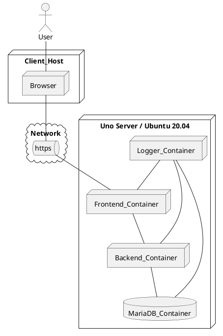

# Ohjelmistoarkkitehtuuri (pohja)

|  |  |
|:-:|:-:|
| Dokumentti | Ohjelmiston arkkitehtuuri kuvaus-pohja |
| Laatija: | DynamiittiOrava |
| Versio: | 3.3 |
| Päivämäärä: | 29.11.2022 |

Tämä dokumentin pohjana käytetään alkuperäistä http://www.cs.tut.fi/ohj/dokumenttipohjat/pohjat/suunnittelu/hytt_drsuunnittelu.doc

*Kiitos alkuperäisen rungon laatijoille.*

# 1.JOHDANTO

### 1.1		Tarkoitus ja kattavuus

>Tällä sivulla avataan Dynamiitti Oravan syksyn 2022 projektin teknistä suunnitelmaa ja toteutusta, keskittymällä tuotoksen ominaisuuksiin. Dokumentin tarkoitus on kirjata projektin teknista tavoitetta ja kuvata tuotoksen ominaisuuksia. Tämä kuvaus on tarkoitettu DynamiittiOravan jäsenille viitteeksi ja sen kattavuus on suhteutettuna siihen tuntemukseen joka tiimin jäsenille muodostui projektin aikana.

### 1.2		Tuote ja ympäristö

>Tuotamme verkkosivuston toimeksiantajalle. GrafiTeam Oy haluaa selkeät sivut jolla heidän asiakkaat saavat tietoa yrityksestä ja tilattavista tuotteista. Sivuston tulee toimia yleisimmillä nettiselaimilla internetissä.

### 1.3		Määritelmät, merkintätavat ja lyhenteet 

>evästeet - verkkosivun lokaalisti tallentama tieto kävijän laitteelle.
>nettisivu - tuottamamme verkkosivusto joka lopulta tarjotaan toimeksiantajalle.
>palikka - viittaa Reactissa toteutettuihin verkkosivun osiin.
>palvelin - jokin osa jota jonkun pitäisi ymmärtää sivuston julkaisemiseksi.
>printti - sana jota toimeksiantaja suosi tuotteestaan, vrt painatus/painotuote/tulostus.
>turbiini - rakennuksen nimi jossa tiimimme pystyi tavata Jamkin Lutakon kampuksella.

### 1.4		Viitteet

>Ulkopuolisia dokumentteja joita hyödynsimme projektin aikana.

 * https://www.npmjs.com/package/react-responsive-carousel

>Testasimme lukuisia muita mahdollisia valmiita osia joita voisi hyödyntää sivustoa kootessa, mutta suurin osa jäi tien varteen. (Valmisosista tarkemmin alla, luvussa 5.)

## 2.		JÄRJESTELMÄN YLEISKUVAUS

>Nettisivu mainostaa ja julkistaa toimeksiantajan yhteystiedot ja tuotteita.

### 2.1		Sovellusalueen kuvaus

>Nettisivu julkaistaan julkisella palvelimella.

### 2.2		Järjestelmän liittyminen ympäristöönsä

>Nettisivu on itsenäinen kokonaisuus, vaikka toki sieltä on linkitys toimeksiantajan sosiaalisen median profiileihin.

### 2.3		Laitteistoympäristö

>Nettisivu toimii yleisimmillä ajantasaisilla internetselaimilla. Tämän lisäksi käyttäjällä tulee olla toimiva internetyhteys. Sivusto on kevyt eikä vaadi laitteilta merkittävää toimintakykyä. 

### 2.4		Ohjelmistoympäristö

>Nettisivu on rakennettu hajoitetulla kehitysprosessilla jakaen projektin eri versioita git-järjestelmän avulla. Kukin kehittäjä toimi omilla alustoillaan, esimerkiksi editorina käytettiin Visual Studio Code (ver. 1.73.1) Windows alustalla. Osana tätä kokonaisuutta toimi Node.js, josta oli myös höytyä automaattisen testauksen puolella.

### 2.5		Toteutuksen keskeiset reunaehdot

>Nettisivun tulee toimia vähintään 20 yhtäaikaisella kävijällä. Nettisivulla ei ole juurikaan interaktiivista sisältöä, niin tämä vaatimus ei ole raskas ja toteutuu palveluntarjoajan sopimuksesta. Nettisivulla ei ole suuria teknisiä turvallisuusriskejä. (Toimeksiantaja kuitenkin toivoi yhteystietonsa olevan selkeästi, mutkattomasti ja salauksetta näkyvillä sivuilla.)

### 2.6		Sopimukset ja standardit

>GrafiTeam Oy:n ja DynamiittiOravan välillä oli sanallainen ystävyyssopimus ilman suurempia vaatimuksia puolin tai toisin. DynamiittiOrava tarjoutui valmistamaan GrafiTeamille uudet nettisivut jotka GrafiTeam saisi käyttöönsä halutessaan.

>Nettisivua rakentaessa otimmi huomioon viranomaisten laatimia sääntöjä ja direktiivejä. Esimerkiksi evästevaatimukset tuottivat paljon keskustelua, vaikka lopulliselle sivulle päädyttiin olla käyttämättä evästeitä.

>DynamiittiOravan jäsenet saavat käyttää projektin jälkeen projektia omissa portfolioissaan, ainakin siltä osin kun tämä ei loukkaa tiimin jäsenten yksityissuojaa tai muuten esitä jäseniä huonossa valossa.

## 3.		ARKKITEHTUURIN KUVAUS

>Tämä on suunnitteludokumentin tärkein kohta. Luku sisältää asiat, jotka kaikkien järjestelmän toteutusta tekevien täytyy tietää ja ymmärtää. Luvussa kuvataan (perusteluineen) mm. suunnittelu¬periaatteet, teknologiavalinnat ja ohjelmiston arkkitehtuuri yleisesti.  Jaottelua alilukuihin ei välttämättä kannata tehdä tässä esitetyllä tavalla, vaan kannattaa miettiä, mikä on kulloisessakin tapauksessa järkevin esitysjärjestys luvun asioille. Esimerkiksi kohdat 3.1 ja 3.2 kannattaa joskus yhdistää.

### 3.1		Suunnitteluperiaatteet

>Tässä kohdassa esitetään kehitettävän järjestelmän toteutuksen  ”perusfilosofia”. Filosofia määrittelee mahdollisimman suppean ja yksinkertaisen joukon peruskäsitteitä ja sääntöjä, joiden mukaan suunnittelupäätöksiä nyt ja tulevaisuudessa tehdään. Peruskäsitteet ja säännöt voivat liittyä kohdan 3.2 arkkitehtuurikuvauksen joihinkin keskeisiin moduuleihin niin kiinteästi, että niiden kuvaus kannattaa siirtää tähän (tai jopa yhdistää kohdat 3.1 ja 3.2). Myös tehdyt teknologiavalinnat voivat olla osa ”sääntöjä”. Filosofian voi ajatella sisältävän järjestelmän toteutuksesta sellaiset asiat, jotka säilyvät (todennäköisesti) muuttumattomina koko elinkaaren ajan. Filosofia helpottaa toteuttajien keskinäistä kommunikointia ja yhdenmukaistaa suunnitteluratkaisuja järjestelmän eri osissa. Esimerkkejä:

  * Ohjausjärjestelmä toteutetaan mikrokontrollerissa ilman käyttöjärjestelmätukea.
  * Järjestelmä jakaantuu osiin seuraavasti: laitteisto¬abstraktiokerros, käyttöjärjestelmäkerros ja sovellusmoduulikerros.
  * Laitteistoabstraktiokerroksen tarkoituksena on piilottaa käytettävän piirikortin ominaisuudet, jotta toteutusalusta on myöhemmin tarvittaessa vaihdettavissa.
  * Käyttöjärjestelmä toteuttaa sovellusmoduulikerroksen prosessien skeduloinnin ja keskeytyskäsittelyn ohjauksen sovellusmoduulikerrokselle.
  * Sovellusmoduulikerroksen moduulit ovat joko passiivisia (kirjastoja) tai aktiivisia (prosesseja). Molempien tyyppien koodirungoista on esimerkki liitteessä x.
  * Kutakin ulkoista keskeytyslähdettä kohti määritellään ko. keskeytyksen käsittelevä aktiivinen sovellusmoduuli.
Esimerkiksi luokka ja tapahtumasekvenssikaavioita voi käyttää kuvauksen selkeyttämiseksi.

### 3.2	 	Ohjelmistoarkkitehtuuri, moduulit ja prosessit

>Tässä kohdassa esitetään yksityiskohtaisesti ohjelmiston jako osajärjestelmiin, ohjelmiin, prosesseihin, moduuleihin, pakkauksiin ja/tai luokkiin. Lisäksi kuvataan moduulinen välistä kommunikointia esimerkiksi tapahtumasekvenssikaavioiden avulla.
Moduuleista erotellaan "valmisosat", eli muualta sellaisenaan tai muokaten napatut osat. Nämä seikat voi kuvata esim. moduulikaaviossa erilaisilla korostuskeinoilla.  
Tässä voidaan myös esittää nimeämiskäytäntöjä, viittauksia tyylioppaisiin yms. kaikkien moduulien toteutukseen liittyviä asioita.

## Suoritysympäristön (tuotanto) kuvaus

  * Miten tuote ajetaan tuotannossa 
  * Sijoittelunäkymä (Depoyment diagram)

### 3.3		Tietokantaarkkitehtuuri

>Tässä kohdassa kuvataan tiedostot ja tietokannat, mm. jako tiedostoihin ja/tai tietokantoihin, tiedostojen ja tietokantojen väliset liittymät, tiedostojen ja tietokantojen organisointi, käytettävät tietokantaohjelmistot (jos on), suojaukset, toipuminen, varmistukset, huolto, ylläpito. 
Tiedostoista ja tietokannoista esitetään rakenne (esim. taulut eli relaatiokuvaukset, mikäli toteutus tehdään relaatiotietokannalla). Suunnitteludokumentissa määrittelydokumentin tietosisältökuvaukset muunnetaan fyysisen tietokannan kuvauksiksi. Esimerkiksi relaatio¬tieto¬kantaa käytettäessä määrittelydokumentin tietosisältökuvauksessa mahdollisesti olevat periytymissuhteet ja montamoneen –yhteydet puretaan. Lisäksi määritellään navigointia varten tarvittavat indeksit. Kuvauksen perusteella pitäisi pystyä kirjoittamaan tietokantaa luotaessa tarvittavat SQLkielen create table ja create index lauseet. Tietokantaratkaisusta ja tiedostoista kuvataan:

  * ratkaisun yleiskuva, tietokannat, tiedostot ja niiden väliset liittymät
  * tietokantaa käyttävät muut ohjelmistot tai järjestelmät
  * tietokannan tukiohjelmisto (esim. varmistukset, toipuminen, testaus)
  * tietokannoista ja tiedostoista
  * tietokannan rakenne (luokkakaavio selityksineen)
  * tiedoston tietueiden kenttien ja tietokannan taulujen sarakkeiden kuvaukset:
  * kentän nimi tai tunniste
  * kentän merkitys
  * kentän pituus ja muoto
  * sallitut arvot tyyppi
  * käsittely tai laskentasäännöt
  * suhteet muihin tietoihin
  * päivityskriteerit ja tavat
  * tilavaatimukset
  * ylläpitonäkökohdat
  * varmistusnäkökohdat
  * suojausnäkökohdat.
	
### 3.4	Virhe ja poikkeusmenettelyt

>Virhe ja poikkeusmenettelyt yleisellä (arkkitehtuuri) tasolla. Luvussa 4 kuvataan tarkemmin moduulitasolla. 
Virheilmoitusten tekstit tulee kiinnittää viimeistään suunnittelussa (olisi parempi miettiä ne jo määrittelyvaiheessa). Virheenkäsittelystä otetaan huomioon seuraavanlaisia asioita:

  * yleiset virhekäsittelysäännöt
  * yleiset moduulit virheiden käsittelemiseksi
  * virheilmoitusten tunnistaminen
  * virheilmoitusten tallettaminen (muistiin, levylle)
  * virheilmoitusten ryhmittely (vakavuus, käyttäjän vai järjestelmän)
  * virheilmoitustekstit.

Toiminta epänormaaleissa tilanteissa kuuluu määrittelydokumenttiin, mutta viimeistään suunnittelussa on asiaan otettava kantaa. Esimerkiksi miten järjestelmä käyttäytyy virtakatkoksissa: "nouseeko itse pystyyn" vai "jääkö jumiin".

### 3.5 Tuotekehitysympäristön kuvaus

>Kuvaa ainakin seuraavat:

* Kehitysympäristö
* Testiympäristö
* Ajo/suoritusympäristö
* Demoympäristö

>Eli miten nuo eri ympäristöt on toteutettu ko. projektissa

## Käytetyt työvälineet ja niiden versionumerot

* Kääntäjä xyz v1.0.1
* debuggeri zky v2.05
* Firefox 123

## 4.		MODUULI /LUOKKA/PROSESSIKUVAUKSET

>Tämän luvun lukurakenne suunnitellaan ohjelman arkkitehtuurin mukaiseksi: Jos yksitasoinen jaottelu riittää, käytetään tässä esitettyä tapaa (4.1 Moduuli X, 4.2 Moduuli Y…). Jos ohjelma jakaantuu esimerkiksi pakkauksiin, joiden sisällä on useita luokkia, kannattaa kullekin pakkaukselle tehdä oma kohtansa, jonka alakohdissa kukin luokka kuvataan. Pakkauksen kaikille luokille yhteiset asiat kuvataan luvun alussa, ja jos pakkauksella on rajapinta, myös se kuvataan tässä. Laajoissa hankkeissa kunkin pakkauksen tai osajärjestelmän sisäisestä rakenteesta kirjoitetaan erillinen suunnitteludokumentti.
Jokaisesta moduulista kuvataan sen tehtävä, liittymät muihin osiin, rajapinta sekä toteutusnäkökohdat. Tekniset yksityiskohdat täytyy selittää niin tarkasti, että kuvauksen perusteella pystytään suorittamaan moduulin testaus mustalaatikkotestauksena.

### 4.1		Moduuli X (kustakin moduulista oma alakohtansa 4.i)

### 4.1.1		Yleiskuvaus 

>Moduulin nimi:
Moduulin tyyppi: (luokka, funktio, prosessi, pakkaus, alijärjestelmä, kirjasto)
Yleiskuvaus: Lyhyt kuvaus moduulista – miksi se on olemassa, mitä se tekee.
Asiakkaat: mitkä/minkä tyyppiset osat järjestelmästä tarvitsevat tämän osan palveluita (yleiskäyttöisen komponentin tapauksessa tämä kohta puuttuu).
Riippuvuudet ja liittymät muihin moduuleihin: Kuvataan lyhyesti, miten moduuli käyttää hyväkseen muita moduuleita ja palveluita ympäristössään (voi usein yhdistää yleiskuvaukseen).

### 4.1.2		Rajapinta yleisesti

>Kuvataan yleisesti moduulin tarjoamat palvelut ja rajapintafunktioiden yhteiset ominaisuudet (esimerkiksi virhetilanteiden käsittely). Joissain tapauksissa kannattaa antaa esimerkkejä moduulin käytöstä kuvaamalla asiakkaan ja moduulin välinen kommunikointi esimerkiksi tapahtumasekvenssikaaviona. Tässä mainitaan myös rajapinnasta mahdollisesti ulos näkyvät vakiot yms. määrittelyt, mahdolliset kapasiteettirajoitukset ja niiden muuttaminen, moduulin tallettamat tilatiedot jne.

### 4.1.3	 	Rajapintafunktiot

>Tässä kuvataan erikseen omassa alakohdassaan jokainen rajapintafunktio:

  * Funktion nimi
  * Funktion parametrit ja paluuarvo
  * Toiminta: mitä funktio tekee
  * Esiehdot: kuvataan, mikä ohjelman tilan pitää olla ennen funktion kutsua.
  * Jälkiehdot: kuvataan, mikä ohjelman tila on funktion kutsun jälkeen (mm. sivuvaikutukset).
  * Virhetilanteet: poikkeukset ja muut virhetilanteet, toiminta kun esiehdot eivät kutsuttaessa pidä paikkaansa

### 4.1.4	 	Moduulin toteutus

Tarvittaessa voidaan antaa ohjeita toteutusta varten, esimerkiksi:
  * Ajatuksia moduulin sisäisten tietorakenteiden toteutuksesta.
  * Ajatuksia käytettävistä algoritmeista. 
  * Tiedossa olevat mahdollisesti uudelleenkäytettävät komponentit.
  * Mikäli moduuli on monimutkainen, voidaan käyttää pseudokoodia, aktiviteettikaavioita yms. Tarvittaessa voidaan tehdä erillinen moduulisuunnitteludokumentti.

### 4.1.5	 	Virhekäsittely

>Kuvataan virheiden ja poikkeusten käsittely moduulitasolla.

## 5.		VALMISOSAT JA ERITYISET TEKNISET RATKAISUT

>Mikäli on valmisosia eli ulkopuolisia komponentteja, niin sellaisista selostetaan:

  * mistä ne saadaan 
  * mihin ne sijoitetaan 
  * käyttö 
  * muuta olennaista (jotta joku toinen osaisi koota sovelluksen tai lisätä ne mukaan). 

>Mikäli jotkin asiat poikkeavat projektin tavanomaisista työtavoista. "Alan tavanomaisista käytännöistä poikkeavat ratkaisut", joita alan työntekijä ei ehkä heti arvaisi. 
>Esimerkiksi seuraavia asioita, mikäli tarpeellista:
  * suojaukset, turvallisuus
  * varmistukset
  * toipumiset
  * ylläpidettävyys
  * joustavuus
  * siirrettävyys tai kannettavuus.

>Varsinkin jos on jokin erityinen tai poikkeava tapa tehdä jotakin. 
Myös toteutusvälineet voidaan mainita tässä, mikäli se on todellakin oleellista kertoa jo tässä (suunnittelu) vaiheessa (harvinaista eikä suositeltavaa, esimerkiksi Bkääntäjän versio 2.77 joka tukee Dkirjastoa 4.56). Projektisuunnitelmassahan on tarkat tiedot toteutusvälineistä. 
Esimerkiksi pystyykö ohjelma toipumaan automaattisesti sähkökatkoista tai käyttöjärjestelmän "kaatumisista"?

	
## 6.	HYLÄTYT RATKAISUVAIHTOEHDOT

>Mietityt, mutta hylätyt, ratkaisuvaihtoehdot kannattaa kirjata perusteluineen johonkin sopivaan lukuun tai kohtaan päivämäärineen. Siten seuraava dokumentin lukija näkee, että tuotakin asiaa on mietitty. Samoin jos itse lukee suunnitteludokumenttia puolen vuoden päästä, voi olla vaikea muistaa, mitä asioita on mietitty järjestelmää tehtäessä. Projektin lopussa hylätyt ratkaisuvaihtoehdot kerätään projektisuunnitelman loppuun.

## 7.	JATKOKEHITYSAJATUKSIA

>Kerätään matkan varrella mieleen tulleita hyödyllisiä ajatuksia, joita ei tämän projektin puitteissa kuitenkaan suunnitella tarkemmin tai toteuteta; esimerkiksi ajan puutteen, rahan puutteen, resurssien puutteen tai taitojen ja osaamisen takia.
Jatkokehitysajatukset kannattaa esimerkiksi numeroida, jotta niihin viittaaminen olisi helpompaa myöhemmin. Päiväys ja ehdottajan nimi(kirjaimet) auttavat jälkitarkastelussa, varsinkin jos lähde on projektin ulkopuolinen, jos vuoden kuluttua projekti saa yllättäen rahoitusta jatkokehitystä varten.
Projektin lopussa tämä luku kerätään projektisuunnitelman loppuun. Jatkokehitysajatukset voi esittää myös omana liitteenään, joka voi tarvittaessa kulkea muidenkin projektin dokumenttien liitteenä. 

  
